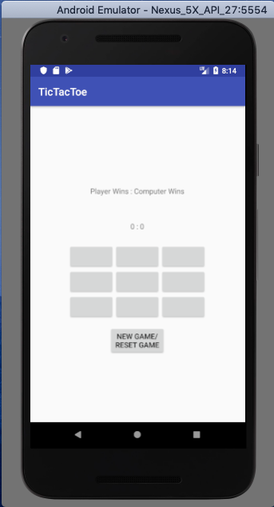
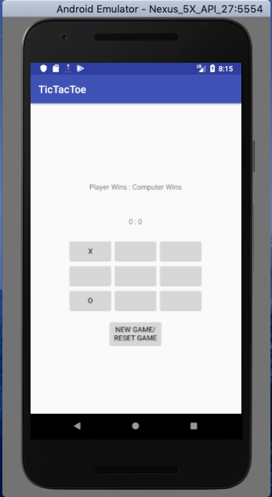
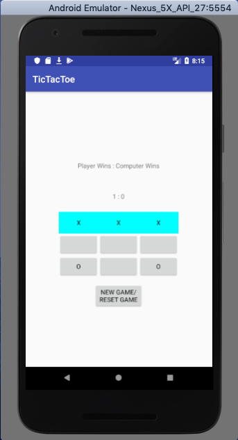

# Project Name
TicTacToe Android
## Purpose
Using Android Studio, this was one of the android applications that I completed for Introduction to Mobile Application Development (COMP 1601) at Carleton University. This app is a tic tac toe game, for which I designed the game logic from scratch; users play tic tac toe by pressing on an available "button", which represents a spot on the game grid.

The "Computer player" that you play against picks where to make their move at random. Once there is a "win" (3 'X' or 'O's in a row horizontally, vertically, and/or diagonally), a notification pops up of who won, the applicable counter is increased, and you must use the NEW GAME/RESET GAME button start a new game. This was designed and implemented according to assignment specifications.
## Screenshots
- Upon starting:

  
- Making a move:

  
- Getting a win:

  
